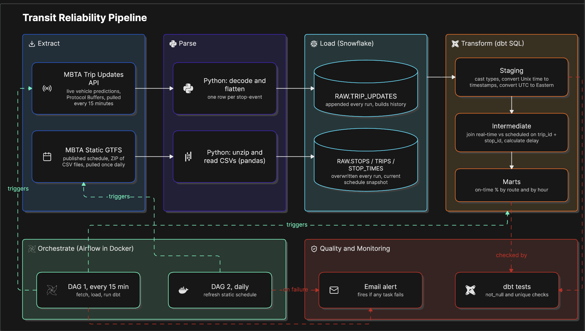
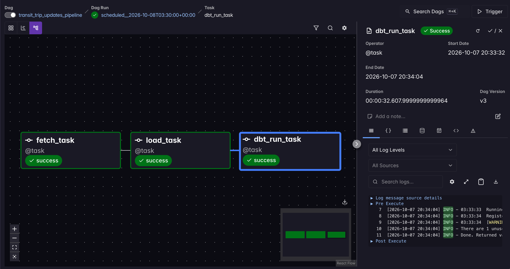
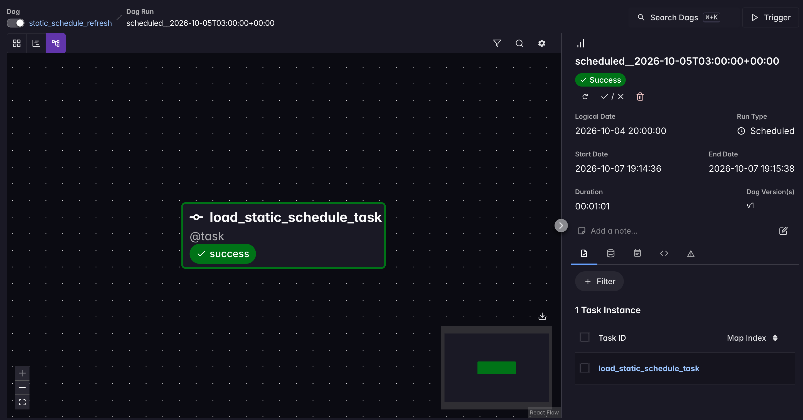
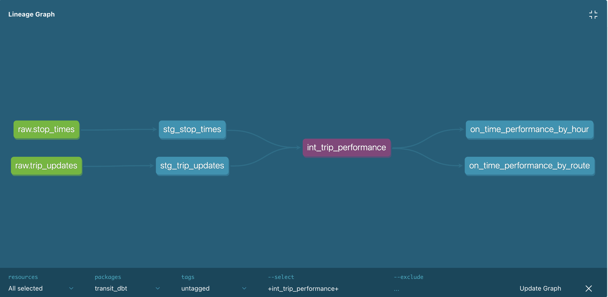
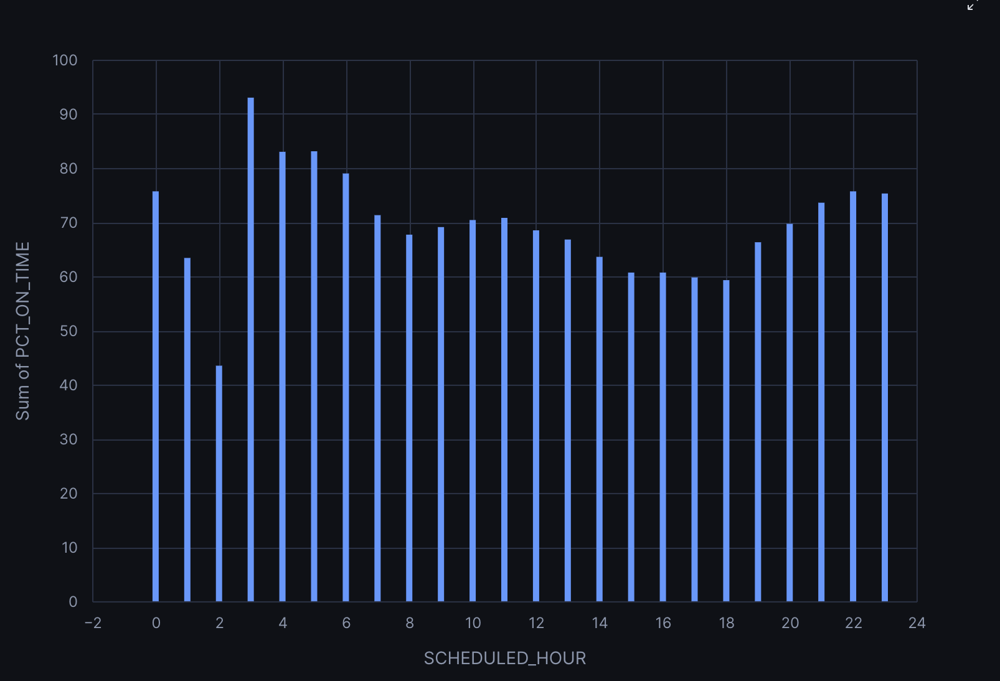

# Transit Reliability Pipeline
 
An automated, orchestrated ELT pipeline that ingests live MBTA (Boston) transit data every 15 minutes, compares it against the published schedule, and calculates real on-time performance metrics — by route and by hour of day.
 
Built to demonstrate core data engineering skills: multi-source ingestion, ELT design, orchestration, transformation with dbt, testing, and failure alerting — using a real, live, messy public data source rather than a static dataset.
 
---
 
## Architecture
 

 


**What each stage is actually doing, and why it's a separate stage:**
- **Extract**: get data out of a source system, as-is — no interpretation yet. Two sources, two different natural frequencies.
- **Parse**: convert whatever format the source uses (binary Protobuf, CSV) into a row/column shape a database can store. This is format conversion, not business logic.
- **Load**: write that parsed data into the warehouse, close to its original form. Two different write strategies (append vs. overwrite) because the two sources represent fundamentally different kinds of data — accumulating events vs. a current snapshot.
- **Transform**: the only place business logic lives — cleaning, joining, calculating, aggregating — all in version-controlled, testable SQL (dbt), not buried in Python scripts.
- **Orchestrate**: decide *when* each piece runs and in what order, and recover/alert when something breaks. This is coordination, not computation — Airflow doesn't know or care what the SQL inside "trigger dbt run" actually does.
- **Quality & Monitoring**: the safety net — automated checks that catch bad data before anyone trusts it, and automated notification when the pipeline itself breaks.
### Orchestration in action
 
**Real-time pipeline** (every 15 minutes — fetch, load, transform):
 

 
**Static schedule refresh** (daily):
 

 
---
 
## The Problem
 
MBTA publishes both a static schedule and a live GTFS-realtime feed, but neither on its own answers a simple question: **how reliably does service actually run compared to what's published, and does that vary by route or time of day?**
 
Answering this requires continuously capturing live predictions over time and comparing them against the schedule — a single one-off data pull can't do it, which is why this is built as an ongoing, orchestrated pipeline rather than a one-time script.
 
---
 
## Data Sources
 
- **MBTA GTFS-realtime feeds** (Trip Updates, Vehicle Positions, Service Alerts) — published directly by MBTA at `cdn.mbta.com`, no API key required. Format reference: [MBTA's GTFS-realtime documentation](https://github.com/mbta/gtfs-documentation/blob/master/reference/gtfs-realtime.md)
- **MBTA static GTFS schedule** — the full published schedule (stops, trips, stop times), refreshed daily: `https://cdn.mbta.com/MBTA_GTFS.zip`
All data is publicly available and used under MBTA's [open data terms](https://www.mbta.com/developers).
 
---
 
## Pipeline Design
 
The pipeline follows an **ELT** (Extract, Load, Transform) pattern: data lands in Snowflake close to its original shape, and all transformation logic lives in version-controlled dbt SQL — not in the ingestion scripts. This keeps a full, unmodified history of raw data available for reprocessing if transformation logic ever changes.
 
**Raw layer** — two Python scripts, orchestrated on two different schedules matched to how often each source actually changes:
- Real-time Trip Updates: decoded from Protocol Buffers, flattened to one row per stop-time-update, **appended** every 15 minutes (accumulating history)
- Static schedule: parsed from CSV, **overwritten** daily (represents "current schedule," not history)
**dbt staging layer** — light cleanup per source: casting types, converting Unix timestamps to real timestamps, and converting real-time UTC timestamps into US Eastern time (see [Technical Challenge](#technical-challenge-the-timezone-bug) below).
 
**dbt intermediate layer** — the analytical core: joins real-time predictions against scheduled times (matched on `trip_id` + `stop_id`), anchoring GTFS's hour/minute/second schedule offsets to each trip's service date and correctly handling GTFS's after-midnight time format (e.g. `25:30:00`). Calculates delay in seconds for every stop-visit.
 
**dbt marts layer** — aggregates row-level delay into business-ready summaries: on-time percentage and average/median delay, by route and by hour of day. "On-time" uses the real industry-standard threshold (no more than 2 minutes early, no more than 5 minutes late) rather than an arbitrary window.
 

*dbt's auto-generated dependency graph, centered on `int_trip_performance` — showing how the staging layer feeds into the join/calculation step, and how that feeds the mart layer.*
 
**Orchestration** — two Airflow DAGs (via Astro CLI + Docker):
- `transit_trip_updates_pipeline`: fetch → load → dbt run, every 15 minutes
- `static_schedule_refresh`: fetch and load the static schedule, once daily
Both DAGs email an alert automatically if any task fails.
 
---
 
## Technical Challenge: The Timezone Bug
 
Early results showed every trip running an implausible ~4 hours late on average. Investigation revealed the cause: GTFS-realtime timestamps are Unix epoch time (always UTC), while MBTA's static schedule times are published in local time with no timezone attached. The two sides of the delay calculation were being compared as if they were in the same timezone when they weren't — a difference of exactly 4 hours, matching US Eastern Daylight Time's UTC offset.
 
**Fix**: converted real-time timestamps to US Eastern using Snowflake's `CONVERT_TIMEZONE`, specifically using the named zone (`America/New_York`) rather than a hardcoded offset, so the conversion correctly handles the Daylight Saving → Standard Time transition automatically.
 
After the fix, median delay dropped from ~14,400 seconds (4 hours) to 31 seconds — consistent with real-world transit performance.
 
---
 
## Results
 
After several days of continuous ingestion (millions of stop-events captured), a clear pattern emerges: **on-time performance is strongly tied to time of day**, consistent with real-world rush hour congestion.
 
| Period | On-Time % | Avg Delay |
|---|---|---|
| Overnight (hours 0, 3, 4, 5) | 75–93% | 40–120 sec |
| Morning commute (7–9 AM) | 67–71% | 82–118 sec |
| Afternoon/evening commute (2–7 PM) | **59–61%** (worst of the day) | **125–197 sec** (worst of the day) |
| Late evening recovery (9 PM–midnight) | 70–76% | 60–177 sec |
 
The single worst hour is **6 PM**, with a 59.3% on-time rate and an average delay of over 3 minutes — nearly double the delay seen overnight. Performance degrades steadily through the day starting around 7 AM and doesn't fully recover until after 9 PM, mirroring the expected shape of morning and evening rush hour congestion.
 
An earlier snapshot also surfaced a specific service disruption: the Orange Line showed a 0% on-time rate with a ~10-minute average delay at one point in time, while most other routes were much closer to schedule — a real, verifiable finding rather than a synthetic one.
 

 
---
 
## Tech Stack
 
| Layer | Tool |
|---|---|
| Ingestion | Python (`requests`, `gtfs-realtime-bindings`, `pandas`) |
| Warehouse | Snowflake |
| Transformation | dbt |
| Orchestration | Apache Airflow (via Astro CLI) |
| Containerization | Docker |
| Alerting | Python `smtplib` (email) |
| Version control | Git / GitHub |
 
---
 
## Repo Structure
 
```
├── dags/                      # Airflow DAG definitions
├── include/
│   ├── scripts/                # Ingestion, loading, and alerting Python modules
│   └── transit_dbt/             # dbt project (staging, intermediate, marts)
├── sql/                        # Hand-documented raw table schemas
├── docs/                       # Diagrams and screenshots
├── requirements.txt             # Python dependencies (installed inside the Airflow container)
└── README.md
```
 
---
 
## Limitations & Future Improvements
 
- **Runs locally via Docker**: data collection has gaps whenever the host machine sleeps. In production, this would run on a persistent server or a managed Airflow service (e.g. AWS MWAA, Google Cloud Composer).
- **"On-time" is a definitional choice**: this project uses a real industry-standard threshold, but on-time performance is a genuinely contested metric — even MBTA's own reported figures have been publicly disputed depending on the threshold used.
- **Small sample sizes on some hours/routes**: a few low-volume hours and routes aren't as statistically reliable as the high-volume ones; this improves the longer the pipeline runs.
- **Planned next steps**: a lightweight Streamlit dashboard for the mart tables; query performance tuning on the large `STOP_TIMES` table; a CI check running `dbt test` on pull requests.
---
 
## Running Locally
 
1. Clone the repo and create a `.env` file with Snowflake credentials and alert email config (see `.env.example`)
2. Install the Astro CLI and Docker Desktop
3. `astro dev start` — starts Airflow locally
4. Trigger either DAG manually from the Airflow UI, or let them run on schedule